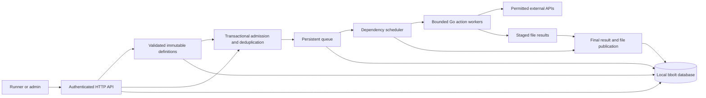

# Kairos API

Kairos is a Go service for reusable workflows, event-triggered API calls, and file transfers. Send it a versioned JSON specification, describe which steps depend on each other, and let bounded Go workers execute the graph. Later steps can use earlier results, and workflows can call other published workflows.

The service stores its catalog, queue, run history, deduplication receipts, and binary files in one local bbolt database. New records use ordered ULIDs. Its database operations are atomic. External API effects still require provider idempotency or reconciliation if a connection fails after acceptance.

Kairos currently runs on one host for one trusted group. It supports finite workflows lasting up to five minutes. Distributed workers, automatic recovery of interrupted effects, long-lived event correlation, schedules, compensation, tenant isolation, and an operator UI remain on the [product roadmap](docs/product-roadmap.md).

## Start here

| Task | Read |
| --- | --- |
| Start the server and execute a workflow | [Quick start](#quick-start) |
| Learn the specification format | [Workflow reference](docs/event-specifications.md) |
| Integrate a client | [HTTP API contract](docs/api.md) |
| Configure limits, credentials, and destinations | [Configuration reference](docs/configuration.md) |
| Work on the Go implementation or add an action | [Developer guide](docs/development.md) |
| Deploy, monitor, upgrade, or restore | [Operations guide](docs/operations.md) |
| Understand files, ULIDs, and transaction boundaries | [Files and atomicity](docs/files-and-atomicity.md) |
| Diagnose a failed request or run | [Troubleshooting](docs/troubleshooting.md) |
| Review original intent and current release evidence | [Architecture review](docs/architecture-review.md) and [verification record](docs/verification.md) |

The [documentation index](docs/README.md) lists every guide and runnable example.

## What you can build

- Publish immutable workflow versions at runtime, or submit an admin-only inline specification.
- Chain HTTP requests with dependency references, path and query parameters, input schemas, conditions, and declared outputs.
- Reuse a pinned workflow inside another workflow. Independent steps share a process-wide action worker limit.
- Start matching workflows with structured CloudEvents-style JSON envelopes and deduplicate deliveries.
- Send JSON, URL-encoded forms, raw text, opaque file bodies, and multipart uploads. Store binary responses as files.
- Inspect run states, attempts, completed child results, and outputs. Cancel queued or active work.
- Keep queued work across restarts, verify file digests, page through ordered records, and download consistent backups.

The built-in actions are `value`, `http`, and `delay`. The compiler also handles the `workflow` subflow action. Other protocols and provider-specific authentication can be added through a Go action factory. A submitted specification cannot execute Go code, a shell command, or a script.

## Quick start

Run these commands from the repository root. The welcome example needs no provider credentials, external API, database server, or container.

Requirements:

- Go 1.26.8, the toolchain selected in [go.mod](go.mod). Dependencies are pinned in [go.sum](go.sum).
- PowerShell 7 for the Windows commands and demonstration scripts.
- Bash, curl, and OpenSSL for the Linux/macOS commands.
- A C compiler and CGO only when running the Go race detector. Normal builds do not require them.

### PowerShell

Generate the credentials once in your server terminal, then start Kairos.

```powershell
go mod download
$tokenBytes = New-Object byte[] 32
[System.Security.Cryptography.RandomNumberGenerator]::Fill($tokenBytes)
$env:KAIROS_API_TOKEN = [Convert]::ToHexString($tokenBytes)
[System.Security.Cryptography.RandomNumberGenerator]::Fill($tokenBytes)
$env:KAIROS_ADMIN_TOKEN = [Convert]::ToHexString($tokenBytes)
go run .
```

In a second terminal, set `KAIROS_API_TOKEN` and `KAIROS_ADMIN_TOKEN` to those same generated values. Separate terminals do not inherit each other's environment changes. Define the client variables, then make your first request.

```powershell
$base = 'http://127.0.0.1:8075'
$runner = @{ Authorization = 'Bearer ' + $env:KAIROS_API_TOKEN }
$admin = @{ Authorization = 'Bearer ' + $env:KAIROS_ADMIN_TOKEN }

Invoke-RestMethod "$base/readyz"
$request = @{ workflow_id = 'welcome'; input = @{ name = 'Ada' } } | ConvertTo-Json -Depth 10
$run = Invoke-RestMethod "$base/v1/runs" -Method Post -Headers $runner -ContentType application/json -Body $request
$run.state
$run.steps[2].output.profile.name
```

The state should be `succeeded` and the name should be `Ada`.

### Bash

Generate the credentials once in your server terminal, then start Kairos.

```bash
go mod download
export KAIROS_API_TOKEN="$(openssl rand -hex 32)"
export KAIROS_ADMIN_TOKEN="$(openssl rand -hex 32)"
go run .
```

In a second terminal, export those same token values. The client commands below use them without placing credentials inside a workflow definition.

```bash
base=http://127.0.0.1:8075
curl --fail-with-body "$base/readyz"
curl --fail-with-body "$base/v1/runs" \
  -H "Authorization: Bearer $KAIROS_API_TOKEN" \
  -H 'Content-Type: application/json' \
  --data-binary '{"workflow_id":"welcome","input":{"name":"Ada"}}'
```

The returned run has three successful steps. Its last step contains `output.profile.name` equal to `Ada`. The bundled welcome definition does not declare a root `output`; inspect its step results.

### Startup behavior

Kairos listens on `127.0.0.1:8075` and creates `data/kairos.db` by default. The process reads environment variables directly. It does not load `.env`. An empty admin token disables publishing, inline specifications, file deletion, and backup downloads.

Startup loads the seed array in [workflows/example.json](workflows/example.json), checks stored data, and compiles the catalog before accepting requests. Run from the repository root or set absolute `KAIROS_WORKFLOWS_FILE` and `KAIROS_DB_PATH` values.

Stop the server with Ctrl+C or SIGTERM. Queued runs stay queued for the next start. An active run canceled by shutdown becomes `interrupted` and requires review.

## Publish and chain reusable workflows

The [greeting definition](docs/examples/greeting.json) validates a name and declares a message output. The [greeting chain](docs/examples/greeting-chain.json) calls that version, then builds a receipt from its output. Neither needs outbound HTTP.

Publish the child before the parent. In the PowerShell client terminal:

```powershell
foreach ($file in @('greeting.json', 'greeting-chain.json')) {
    $spec = Get-Content -Raw -LiteralPath "docs/examples/$file"
    Invoke-RestMethod "$base/v1/workflows" -Method Post -Headers $admin -ContentType application/json -Body $spec
}
$request = Get-Content -Raw -LiteralPath docs/examples/greeting-run.json
$run = Invoke-RestMethod "$base/v1/runs" -Method Post -Headers $runner -ContentType application/json -Body $request
$run.output.receipt
```

In Bash:

```bash
for spec in docs/examples/greeting.json docs/examples/greeting-chain.json; do
  curl --fail-with-body "$base/v1/workflows" \
    -H "Authorization: Bearer $KAIROS_ADMIN_TOKEN" \
    -H 'Content-Type: application/json' --data-binary "@$spec"
done
curl --fail-with-body "$base/v1/runs" \
  -H "Authorization: Bearer $KAIROS_API_TOKEN" \
  -H 'Content-Type: application/json' \
  --data-binary @docs/examples/greeting-run.json
```

The receipt contains `message: "Hello Ada"` and the root run ID. In the parent specification, `depends_on` orders the receipt step after the greeting. `{"$ref":"/steps/greet/message"}` copies the child's declared output.

A published version is immutable. Publishing identical content again succeeds; changing it requires a new version. Child references require an explicit version and remain pinned when a newer child is published. A child must declare `output` before it can be reused.

See the [specification reference](docs/event-specifications.md) for every definition field, reference operator, condition, retry rule, and HTTP option.

## Run lifecycle and duplicate requests

`POST /v1/runs` waits up to 30 seconds by default. Add `"async": true` to return after durable queue admission. HTTP 202 means the stored run is still queued or running. Client disconnection does not cancel it.

Use a stable `Idempotency-Key` when retrying the same operation. Kairos returns the original run while its receipt remains retained. Changed content under the same key returns 409. A new operation needs a new key.

Inspect and cancel using the returned `id`:

```powershell
Invoke-RestMethod "$base/v1/runs/$($run.id)" -Headers $runner
Invoke-RestMethod "$base/v1/runs?limit=25" -Headers $runner
Invoke-RestMethod "$base/v1/runs/$($run.id)/cancel" -Method Post -Headers $runner
```

Canceling an already terminal run returns its existing state. Active cancellation is cooperative and cannot retract a remote effect. Terminal run states are `succeeded`, `failed`, `timed_out`, `canceled`, and `interrupted`. A failed run can contain evidence of earlier successful steps.

New runs use a ULID for both `id` and `sequence_id`. Lists return `next_before` for cursor pagination. ULID order tracks allocation within one database, not completion order across concurrent steps.

## Run the complete local API demo

This demonstration uses a separate localhost fixture. It creates no real customer and sends no real notification.

1. In a separate terminal, run `go run ./cmd/demo-api`. The fixture listens on `127.0.0.1:9081`.
2. Stop Kairos, set the two variables below in its server terminal, and restart it with the same tokens and database.
3. In your PowerShell client terminal, run `./scripts/demo-api-chain.ps1`.

```powershell
$env:KAIROS_HTTP_ALLOWED_ORIGINS = 'http://127.0.0.1:9081'
$env:KAIROS_ALLOW_PRIVATE_NETWORKS = 'true'
go run .
```

The script publishes [http_request](workflows/reusable-http.json) and [customer_events](workflows/customer-events.json), delivers an event, inspects the result, and repeats the event. It checks that the fixture received exactly one customer request and one notification.

Bash users can follow the [example walkthrough](docs/examples/README.md#customer-event-chain), including publication and event delivery.

HTTP traffic is disabled by default. Exact configured HTTPS origins allow provider integrations. `*` allows public HTTPS destinations subject to connection-time address checks. Private-network access requires exact origins and the explicit development option above. See [outbound network policy](docs/configuration.md#outbound-network-policy).

## Work with files

Kairos stores arbitrary bytes without parsing or converting the file format. PDFs, images, archives, audio, video, office documents, CSV, and unknown formats use the same storage path. The default per-file limit is 32 MiB; file bytes stay outside the workflow JSON payload budget.

Upload a local file in the PowerShell client terminal:

```powershell
$filePath = './README.md'
$uploadHeaders = @{
    Authorization = $runner.Authorization
    'X-File-Name' = 'README.md'
    'X-Content-SHA256' = (Get-FileHash -LiteralPath $filePath -Algorithm SHA256).Hash.ToLowerInvariant()
    'Idempotency-Key' = [guid]::NewGuid().ToString()
}
$uploaded = Invoke-RestMethod "$base/v1/files" -Method Post -Headers $uploadHeaders -ContentType application/octet-stream -InFile $filePath
$uploaded.reference
```

Keep that key and request content unchanged when retrying the upload. The response includes a `{"$artifact":"ULID"}` reference and file metadata. Pass the reference in a workflow input or event's JSON data. Use `encoding: "file"` for an entire HTTP request body, `encoding: "multipart"` for form uploads, and `response_mode: "file"` for binary responses.

With Kairos and the local demo API running, execute `./scripts/demo-file-chain.ps1`. It uploads 196,613 bytes, sends them through a raw HTTP call, forwards the response as multipart data, checks the downloaded digest, and downloads a consistent database backup. The script requires both tokens and writes evidence under ignored `bin/verification`.

Files produced by an active workflow remain hidden from public file endpoints. The final run transaction publishes files referenced by its recorded results. Referenced files cannot be deleted while their owning run or definition remains retained. Read the [file lifecycle and recovery contract](docs/files-and-atomicity.md) before building a file-dependent workflow.

## Architecture and guarantees



Admission commits before a worker can dispatch an action. The default limits are 8 active leaf actions, 16 active root runs, and 128 additional queued runs. A parent waiting for a subflow does not hold a leaf action slot. Limits on graph size and nesting bound the orchestration goroutines.

Transactions commit local state, IDs, indexes, receipts, and relevant file records together. File reads verify SHA-256 before returning bytes. Queued work survives restart. Previously active work becomes `interrupted` and is never resumed automatically.

An arbitrary remote API cannot join this local transaction. Stable provider idempotency keys, business-level reconciliation, and a deliberate recovery decision remain necessary for uncertain effects. Kairos does not promise exactly-once effects or automatic rollback of a whole chain.

## Configuration and deployment

[.env.example](.env.example) lists the available environment settings. The [configuration reference](docs/configuration.md) gives defaults, accepted ranges, fixed protocol limits, and credential behavior.

For a container build, set the same token environment variables first:

```sh
docker compose config --quiet
docker compose up --build -d
docker compose logs -f kairos
```

Compose binds the host port to localhost and mounts `kairos-data` at `/data`. The image runs as a non-root user with a read-only root filesystem. Use one replica per local database file. Provider secrets must be passed explicitly into the container. Host environment variables override only the fields that Compose interpolates; changing other settings requires editing Compose or an override file.

The [operations guide](docs/operations.md) covers TLS gateway requirements, startup checks, shutdown, backups, restore, upgrades, and release gates. Container execution and hosted deployment have not been verified in the current evidence record.

## Develop and verify

```sh
go test -count=1 ./...
go vet ./...
go test -race -count=1 ./...
go run golang.org/x/vuln/cmd/govulncheck@v1.8.0 ./...
go build -trimpath -o bin/kairos .
```

On Windows, build with `go build -trimpath -o bin/kairos.exe .`. The race detector requires a supported C compiler; Linux under WSL is the verified Windows-host route. The [developer guide](docs/development.md) covers focused checks, coverage, and adding a Go action with a complete example.

Tests use temporary databases and local HTTP fixtures. They include a child-process kill and backup restoration. The [verification record](docs/verification.md) records 55 passing tests plus subtests, Linux race checks, native demonstrations, and the remaining deployment gaps. It is dated evidence, not a claim that every future checkout has passed.

| Source | Responsibility |
| --- | --- |
| [server.go](server.go) | Startup wiring, action registry, HTTP server, shutdown |
| [internal/api](internal/api) | Authorization, request decoding, workflow/run/event/file routes |
| [internal/orchestrator](internal/orchestrator) | Catalog, queue, transactions, run indexes, retention, recovery |
| [internal/workflow](internal/workflow) | JSON and schema validation, graph compilation, templates, execution |
| [internal/action](internal/action) | HTTP requests, file request bodies, value assembly, short delays |
| [internal/artifact](internal/artifact) | File chunks, integrity, reference pins, publication, backup |
| [internal/identity](internal/identity) | Process and persistent monotonic ULID allocation |
| [internal/config](internal/config) | Environment parsing and startup limits |
| [workflows](workflows) | Welcome seed and reusable HTTP, event, and file specifications |
| [cmd/demo-api](cmd/demo-api) | Local provider fixture |
| [scripts](scripts) | Smoke and complete demonstration scripts |

## Project history and release status

Kairos began as a fixed dispatcher for commands combining Stripe, Slack, and CMS operations. The [architecture review](docs/architecture-review.md) explains the evidence for that original intent, its implementation problems, and the move to reusable specifications.

The old `/api` contract and provider-specific handlers are retired. Historical code remains at commit `6726dbc93e6e2ae8d4a8c1bc32b2b248fb09cd80`. Credentials committed there must be rotated before any related integration is deployed. Removing them from the current files does not remove them from Git history.

The repository has no license file. Resolve licensing before distributing a release. The [roadmap](docs/product-roadmap.md) separates the implemented single-host service from the remaining work on distributed recovery, verified provider connectors, tenant controls, and an operator interface.
