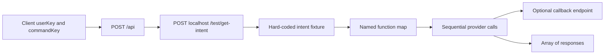
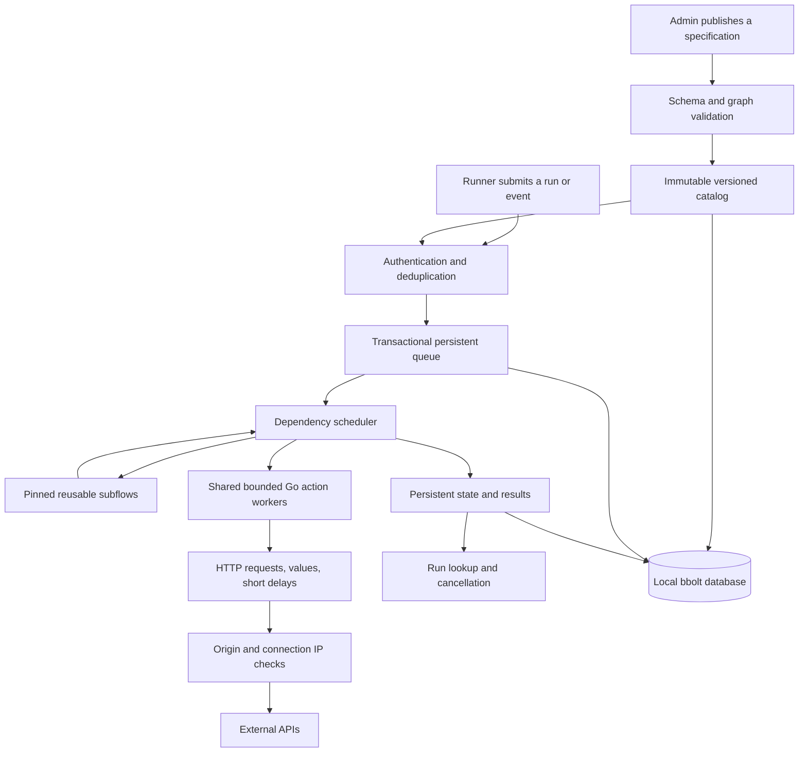

# Kairos architecture review

[Documentation index](README.md) · [Current developer guide](development.md)

Reviewed October 7, 2026. Historical baseline `6726dbc93e6e2ae8d4a8c1bc32b2b248fb09cd80`, the repository's only commit at review time, dated February 19, 2024 and titled "Kairos Api Old".

## What Kairos was supposed to do

Kairos was an intent-driven backend for combining several service operations behind one client request. The client sent a user key, a command key, and data. Kairos resolved that command into an ordered list of named functions, executed them, and returned their results. A client could ask for a business operation without coordinating every provider call itself.

The code directly supports this reading. The [request model](https://github.com/bclonan/kairosapi/blob/6726dbc/model/request_data.go) has `userKey`, `commandKey`, and `data`. The [dispatcher](https://github.com/bclonan/kairosapi/blob/6726dbc/controller/base.go) maps function names to Stripe charges, subscriptions, API-key storage, Slack messages, and CMS page data. Several adapters send results to another endpoint. That looks like an execution service working with a separate application that owns intent definitions and receives outcomes.

The likely direction was a configurable integration platform with a central command catalog. The clearest evidence is the [combined intent fixture](https://github.com/bclonan/kairosapi/blob/6726dbc/router/routes.go), which chains Slack, a Stripe charge, key storage, and another charge. The repeated charge matters. It shows a need for reusable actions with separate step instances, which the data model could not express properly.

That product direction is an inference from the code. There was no README, roadmap, architecture document, schema, or other historical commit to establish a broader original plan. MongoDB and PostgreSQL environment variables were declared but unused. They do not establish an implemented storage design. There was no explicit goroutine scheduling, queue, persistent run state, or event subscription system.

## The original execution path

The lookup points back to the same server's test route. It does not connect to a real catalog. Gin and Go can serve concurrent HTTP requests, but each workflow runs synchronously inside its request handler. That is different from managing workflow jobs in a worker pool.

## Findings in priority order

The historical links below identify the code before cleanup. The assessment describes observed code paths, not a claim that an exploit or provider operation was executed.

| Priority | Finding and consequence | Evidence | Disposition |
| --- | --- | --- | --- |
| P0 | Credential strings, a Slack webhook URL, and encryption key material were committed. Code also prints request and intent data and includes a Slack token in a panic. The repository must be treated as an exposure source. | [Slack adapter](https://github.com/bclonan/kairosapi/blob/6726dbc/controller/slack/slack.go), [routes](https://github.com/bclonan/kairosapi/blob/6726dbc/router/routes.go), `utils/openssl/keys`, `controller/base.go` | Removed from the current files. Provider rotation and any history cleanup remain operational work. No old credential was tested. |
| P0 | There is no implemented caller authentication or authorization. A nonempty user key passes the dispatcher check. Test fixtures are mounted with the service. | [Empty auth package](https://github.com/bclonan/kairosapi/blob/6726dbc/controller/auth/auth.go), `controller/base.go`, `router/routes.go` | New bearer-authenticated endpoints and an operator-owned workflow catalog. Shared-token authentication is still not tenant isolation. |
| P0 | Stripe operations write a process-global API key. Concurrent requests for different accounts can race and use the wrong credential. Adding goroutines would make this defect more dangerous. | [Stripe adapter](https://github.com/bclonan/kairosapi/blob/6726dbc/controller/stripe/stripe.go) | Retired the old adapter. Prepared HTTP actions have isolated request headers and no provider-global key. |
| P1 | The build cannot be reproduced with the installed Go module toolchain. The baseline `go test ./...` fails before compilation because there is no module. Inspection also finds `SaveAPIKey(nil)` with the wrong signature and a test import from another private project. | [Dependency manifest](https://github.com/bclonan/kairosapi/blob/6726dbc/Gopkg.toml), [Stripe test](https://github.com/bclonan/kairosapi/blob/6726dbc/controller/stripe/key_test.go), [crypto test](https://github.com/bclonan/kairosapi/blob/6726dbc/utils/openssl/openssl_test.go) | Go module with pinned dependencies, local tests, build instructions, and CI. |
| P1 | Error paths can panic or continue after writing an error. The variadic helper expects status before context but receives the reverse. A failed HTTP call dereferences `resp.StatusCode`; JSON failures are ignored. Several errors return HTTP 200. | [Dispatcher](https://github.com/bclonan/kairosapi/blob/6726dbc/controller/base.go), [response helper](https://github.com/bclonan/kairosapi/blob/6726dbc/controller/common/response.go) | Explicit error returns, typed HTTP status handling, graph validation, and panic containment at action execution. |
| P1 | Function numbers index a slice without validating continuity or bounds. An unknown function can produce a nil call. Repeated functions share one data entry because configuration is keyed by function name. | `controller/base.go`, [intent model](https://github.com/bclonan/kairosapi/blob/6726dbc/model/intent.go) | Ordered step objects with unique IDs, separate configuration, dependency validation, and cycle detection. |
| P1 | Outbound calls have no timeout or cancellation propagation. Reads are unbounded; the intent lookup does not close its response body. Callback URLs lack destination restrictions. | `controller/base.go`, `controller/slack/slack.go`, `controller/stripe/stripe.go` | Context-aware requests, body and header limits, exact origin allowlist, connection-time IP checks, and disabled redirects and proxy inheritance. |
| P1 | Cryptography uses a repository key, a fixed IV, unauthenticated AES-CBC, and `math/rand` for key generation. Decrypt results and errors are discarded in provider handlers. | [Key generation](https://github.com/bclonan/kairosapi/blob/6726dbc/utils/openssl/create_keys.go), [cipher](https://github.com/bclonan/kairosapi/blob/6726dbc/utils/openssl/openssl.go), provider adapters | Removed the old crypto and key-storage path. Environment secret references replace it. Fixed-target actions resolve values at compilation. A managed secret store remains a product requirement. |
| P1 | An external operation can succeed while its callback fails. The whole step then appears failed, so a caller retry can repeat a charge or message. There is no idempotency record or reconciliation state. | `CreateCharge`, `CreateSubscription`, `SendMessage`, and their `SendData` calls | Added persistent admission receipts and opt-in retries for actions declared idempotent. Provider reconciliation remains required before payment workflows. |
| P2 | Tests send messages, create Slack groups, access live services, and write key files. Some tests only print data. There is a tracked 21.6 MB binary and a log file, with no deployment or shutdown configuration. | [Slack tests](https://github.com/bclonan/kairosapi/blob/6726dbc/controller/slack/slack_test.go), crypto tests, [old entry point](https://github.com/bclonan/kairosapi/blob/6726dbc/server.go) | Replaced with isolated local tests. Removed generated artifacts. Added container packaging, environment validation, structured logs, and graceful cancellation. |

## The current architecture

The expansion now accepts runtime publications and event delivery. It persists an immutable catalog, queue admission, run records, and deduplication receipts in bbolt. It implements conditions, declared outputs, pinned subflows, schema validation, bounded retries, inspection, and cancellation.

`internal/orchestrator` owns the catalog, queue, receipts, and database transactions. Admission and event fanout commit before workers execute. One service instance owns the database file. Published and inline runs pin child workflow versions. A parent waiting for a child does not hold a leaf worker slot, so nested execution works with one worker.

`internal/artifact` now stores opaque files in the same database. Raw and multipart HTTP steps exchange immutable file references. A run's terminal transaction publishes its completed file outputs and removes unreferenced staging data. `internal/identity` allocates persistent ULIDs in those transactions. Run listing uses an indexed sequence, and the admin API exports a consistent backup. See the [atomicity and recovery contract](files-and-atomicity.md) for boundaries, limits, and restore steps.

`internal/workflow` compiles an acyclic graph and executes it through context-aware handlers. It copies resolved inputs, normalizes action outputs, and collects completions through bounded channels. A step's input must resolve to an object. Runtime data remains literal when referenced, so a caller cannot inject another expression through its input.

`KAIROS_WORKERS` bounds active leaf actions across the process. `KAIROS_MAX_RUNS` bounds active root runs. The persistent queue admits at most that active capacity plus `KAIROS_QUEUE_SIZE`. Each definition has at most 32 direct steps; expansion across subflows has at most 128 steps and 8 levels. These bounds also limit orchestration goroutines. HTTP connection goroutines need separate limits at the gateway.

Before dispatch, the engine writes progress through an observer. If that write fails, it cancels execution and the service fails readiness. Root step progress is stored during execution. Completed subflow results include child details, but child histories are not restart checkpoints. The database stores terminal results and inputs subject to retention and count limits.

Queued work resumes after restart. Work interrupted during execution becomes `interrupted`. It does not resume automatically because the external API may have accepted an operation before Kairos recorded its result. This distinction is deliberate. A durable queue and durable result records do not provide durable replay of each effect.

The HTTP action now accepts fixed or explicitly enabled input URLs and methods. It supports JSON, form, and raw text bodies, path parameters, repeated query values, configured input headers, selected response headers, response predicates, and stable per-step idempotency headers. An operator still controls outbound origins and access to server credentials. Publishing and inline execution require the separate admin token.

## What the tests establish

Local tests exercise reusable HTTP chains, event deduplication, immutable publication, version pinning, branches, validation, retries, cancellation, and persistence. A nested chain runs with one worker. Race testing runs on Linux under WSL. A separate native demo API verifies customer creation followed by notification, duplicate-event suppression, and preserved history after restart.

The [verification record](verification.md) names the commands, environments, and remaining gaps. Local fixtures do not establish provider compatibility or production load capacity.

## Where the product should go next

The current implementation is useful for controlled, finite HTTP automation on one host. Its deployment model is explicit and its original fixed command map is gone. The larger product still needs a durable execution backend for multi-host recovery, long waits, and signals that resume an existing process.

I would adopt Temporal when those requirements become concrete. Execute each external action as an activity and pin the specification in the workflow history. Wrapping an entire Kairos chain in one retryable activity would repeat already completed effects. Temporal workflow code uses [its Go concurrency APIs](https://docs.temporal.io/develop/go/best-practices/multithreading); ordinary goroutines remain appropriate inside bounded activity workers. Avoid running a second competing scheduler for the same state.

A custom PostgreSQL execution backend is another option, but it must own atomic claims, leases, fencing, heartbeat expiry, attempts, and an outbox. That is a substantial correctness obligation. bbolt currently provides local transactions and file ownership, not distributed coordination.

"Any API" means HTTP request/response support plus maintained action adapters for other protocols and authentication schemes. "Any chain of events" also needs bounded iteration, long timers, correlated external signals, compensation, and explicit recovery decisions. Adding those behaviors requires contracts and failure tests, not more names in a dispatch map.

The [roadmap](product-roadmap.md) orders the remaining work around concrete release evidence.
