# Files, ordered identity, and atomicity

[Documentation index](README.md) · [Backup commands](operations.md#download-and-verify-a-backup)

Kairos commits its database changes atomically. It cannot commit or roll back an arbitrary remote API in the same transaction. An HTTP timeout can occur after a provider accepted a request. A request failure can fail the run, while process interruption leaves it `interrupted` on recovery. Neither outcome reverses the provider's effect.

## What commits together

| Operation | One database transaction contains |
| --- | --- |
| Publish a definition | Immutable version, publication ULID, and literal file reference pins |
| Admit a run or event | All accepted runs, queue entries, run indexes, file reference pins, deduplication receipt, and ULID allocation |
| Upload a file | Every binary chunk, metadata, digest, quota counter, optional upload receipt, and ULID allocation |
| Record progress | Run snapshot, summary index, and references to completed file outputs |
| Finish a run | Final result, terminal state, expiry index, file publication, file reference pins, and deletion of unreferenced staged bytes |
| Recover an active run | Interrupted result, publication of referenced completed file outputs, and deletion of unreferenced staged bytes |
| Delete an unreferenced file | Metadata, chunks, upload receipt, and quota counter |
| Prune a run | Expired result, indexes, and its file reference pins |

Upload and run submission are separate operations. An uploaded file remains available if a later submission fails. Earlier completed external effects also remain if another step fails. Completed step files remain part of a failed or interrupted run's evidence. Atomicity does not mean the whole workflow has all-or-nothing business effects.

The database uses normal bbolt synchronization. No `NoSync` mode is enabled. One process owns one database on a local filesystem. Guarantees depend on that filesystem and storage device honoring flushes. This implementation has no replicated storage or failover host.

```mermaid
flowchart LR
    Input[File bytes] --> Spool[Bounded temporary file]
    Spool --> Upload[Atomic chunks metadata and digest]
    Upload --> Ready[Published upload]
    Ready --> Run[Queued workflow]
    Run --> API[External HTTP request]
    API --> Staged[Hidden file response]
    Staged --> Next[Dependent steps in the same run]
    Next --> Finish[Atomic final state and file publication]
    Finish --> Download[Verified download]
```



## Opaque files

Kairos stores arbitrary byte sequences. PDFs, images, archives, audio, video, office documents, CSV, JSON, and unknown formats use the same path. Empty files are valid. The service does not parse, convert, extract, or validate their internal format. Names and MIME types describe bytes supplied by the caller.

File bytes live in 64 KiB database chunks. They do not consume the 256 KiB JSON payload budget. Each file has a ULID, name, media type, byte count, SHA-256 digest, creation timestamp, and optional original content encoding.

Upload raw bytes to `POST /v1/files` with a runner or admin token.

| Header | Meaning |
| --- | --- |
| `Content-Type` | File media type; defaults to `application/octet-stream` |
| `X-File-Name` | Optional display name, at most 255 UTF-8 bytes; defaults to `file.bin` |
| `X-Content-SHA256` | Optional expected SHA-256 in lowercase hexadecimal; mismatch rejects the upload |
| `Idempotency-Key` | Optional stable key of at most 256 bytes |
| `Content-Encoding` | Optional encoding metadata retained without decoding |

Filenames cannot contain path separators or control characters. The storage path comes from server configuration. A file name never selects a filesystem path.

A successful upload returns 201 with `file`, `reference`, and `duplicate: false`. An identical retry returns 200 with the original ID and `duplicate: true`. Its name, media type, content encoding, and digest must agree. Changed content under the same key returns 409.

```json
{
  "file": {
    "id": "01M4BW1FJDJVSPH8R0J5H1QSS0",
    "name": "copy.bin",
    "media_type": "application/octet-stream",
    "size": 196613,
    "sha256": "1995571d3b74ff514cef27acc5a3043df9bb343e6ea8d2810abbac1362dedafb",
    "created_at": "2026-10-07T19:04:30Z"
  },
  "reference": {"$artifact": "01M4BW1FJDJVSPH8R0J5H1QSS0"},
  "duplicate": false
}
```

The actual reference also includes descriptive metadata. Only `$artifact` determines identity. Submit that object in workflow input or JSON event data. CloudEvents `data_base64` remains unsupported; upload the bytes first and send their reference.

Download original bytes with `GET /v1/files/{id}/content`. The service verifies the complete stored digest before starting the download. It sets attachment disposition, the stored media type, `X-Content-SHA256`, and an ETag. Byte ranges are supported. The optional `X-File-Content-Encoding` header describes the original encoding without asking the download client to transform the bytes.

## File steps and visibility

Use `encoding: "file"` to send a referenced file as the entire HTTP body. Use `encoding: "multipart"` for form fields and up to 16 file parts. The multipart aggregate must fit the file size limit. Both modes verify the stored bytes before dispatch.

Use `response_mode: "file"` to store an HTTP response unchanged. Set `response_name` to a display name. The adapter requests identity content encoding unless the workflow supplies another Accept-Encoding header. If the provider returns compressed bytes anyway, Kairos retains their encoding metadata. A later file request forwards that metadata.

An HTTP file response belongs to its root run while execution continues. Dependent steps and nested subflows in that run can read it. Public file reads and lists hide it until the final run transaction. Another run cannot reference it during execution.

A failed or interrupted run publishes files referenced by its recorded completed steps. It discards staged files absent from those results. A child workflow's step history reaches the root checkpoint when the child finishes, so files from an unfinished child may be discarded after a process failure. This is not durable child-step replay.

The [file relay definition](../workflows/file-relay.json) sends an uploaded file, retains the API response, then sends that response as multipart data. Run `scripts/demo-file-chain.ps1` against Kairos and `cmd/demo-api` to reproduce the byte comparison and backup download.

## ULIDs and ordering

New runs, files, publication records, and intake receipts use canonical 26-character uppercase [ULIDs](https://github.com/ulid/spec). One database transaction allocates each persistent ID and advances the stored sequence. Within that database, later committed allocations sort after earlier ones, including allocations in the same millisecond or after a backward clock adjustment. Failed transactions do not publish their IDs.

Workflow names, step names, and caller-supplied CloudEvent IDs remain logical identities. Published versions also expose `publication_id`; accepted events expose `receipt_id`. New run `id` and `sequence_id` are equal. Format 1 databases migrate in one transaction. Existing run IDs remain valid, and their new `sequence_id` follows historical creation order.

`GET /v1/runs` and `GET /v1/files` list newest records first. Use `limit=1..100` and the returned `next_before` as the next exclusive `before` cursor. Run listing reads bounded metadata through an index rather than decoding every stored result. File listing filters out staged records.

ULID order records allocation order, not causal order between different events or completion order between goroutines. A clock rollback may make the logical ULID timestamp newer than wall time. There is no global sequence across separate databases. Restoring an older backup restores its sequence too; do not run a restored copy and the original as one shared identity domain.

## Limits and retention

| Setting | Default | Supported bound |
| --- | --- | --- |
| `KAIROS_FILE_MAX_BYTES` | 33,554,432 bytes | 1 byte through 256 MiB |
| `KAIROS_FILE_TOTAL_BYTES` | 268,435,456 bytes | At least the per-file limit, up to 1 TiB |
| `KAIROS_FILE_MAX_COUNT` | 1,000 files | 1 through 100,000 |
| `KAIROS_FILE_TRANSFERS` | 2 transfers | 1 through 16 |

Staged and published files both consume quota. Downloads, uploads, multipart assembly, and backups share the transfer slots. Saturation returns 429 instead of starting an unbounded transfer. File upload reads have a one-minute deadline; downloads have a two-minute write deadline. Workflow file calls remain under their step and run deadlines.

File quotas cover retained payload bytes. Database pages, run history, temporary input and output spools, and backups require extra disk space. Large write transactions also need memory for their chunks. Raise limits only after measuring the deployment's memory and disk use. Deletion frees reusable database pages; it does not shrink the database file.

Only an admin can delete a published file. Deletion returns 409 while a retained run or published definition references it. Run pruning releases its pins. Published versions are immutable and have no deletion endpoint, so their literal file references remain pinned. Files have no automatic TTL. Delete unreferenced files explicitly. Deletion also removes that file's upload idempotency receipt.

## Backup and restore

`GET /v1/admin/backup` creates a consistent snapshot before sending it to the client. The response includes `Content-Length` and `X-Content-SHA256`. It contains the catalog, run history, queue, receipts, file bytes, file reference pins, and ULID sequence. It does not contain environment variables or provider secret values unless a workflow previously retained them in its inputs or outputs.

1. Download the snapshot with the admin token. Compare its local SHA-256 with the response header and retain the file with restricted access.
2. Stop the target Kairos process. Restore into a new local database path and keep the previous database as a separate recovery copy.
3. Configure the same action registry, seed definitions, origin policy, and secret names. Keep the original instance stopped if this is a replacement.
4. Start Kairos against the restored path. Startup checks bbolt structure, file digests, and run indexes before it starts workers.
5. Inspect interrupted runs and confirm provider outcomes. Queued runs can start immediately. For inspection without outbound calls, deny destinations at the deployment network layer until the queue has been reviewed.

Do not restore while a process owns the target database. Do not copy a live database directly. Use the snapshot endpoint or stop the process first. A database restore never reverses a provider's state.

## Fault behavior

Incomplete bodies, size violations, digest mismatches, canceled uploads, and quota failures create no file record. A successful acknowledgment comes after commit. If the commit succeeds but the client misses the response, a retry with the same idempotency key retrieves the committed result.

The service copies verified downloads to temporary files before network delivery, so slow clients do not hold database read transactions. Temporary files are private and live beside the database in `<database-path>.uploads`. Startup removes abandoned Kairos spool files after obtaining the database lock.

A failed durable progress write stops new action dispatch and fails readiness. Corrupted stored bytes fail checksum verification before they leave the file store. Startup refuses an inconsistent database instead of starting with partial records. An invalid `$artifact` returned by an action fails that run and leaves the service available.

Tests cover atomic rollback, interrupted bodies, quota enforcement, clock reversal, concurrent ULIDs, file corruption, native backup restoration, and a forcibly killed worker process. They do not establish tolerance of every power-loss pattern, storage device failure, provider acceptance window, or distributed partition. Recovery of uncertain external effects still requires provider idempotency or business-level reconciliation.
