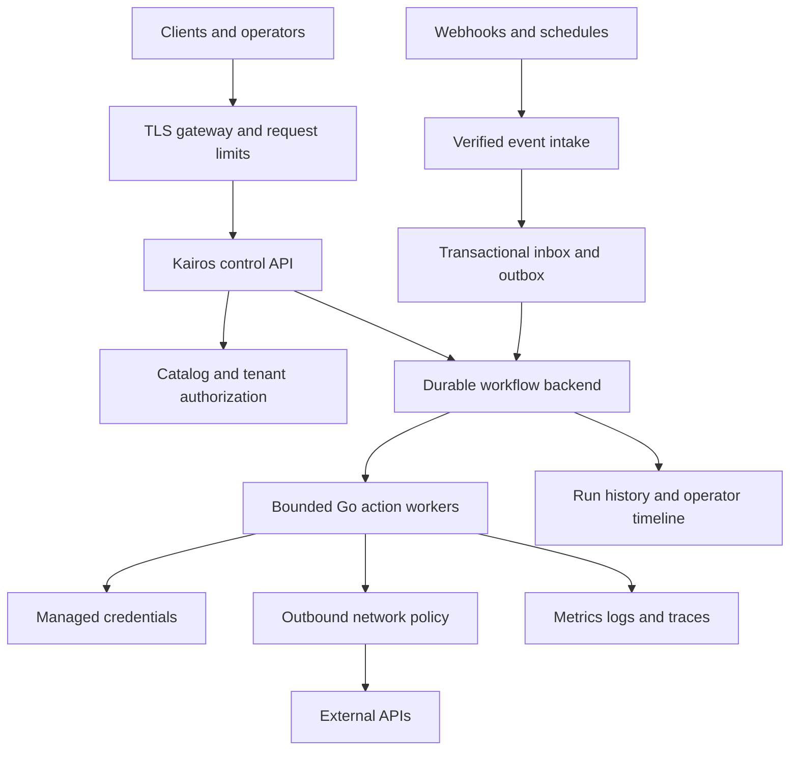

# Product roadmap

[Documentation index](README.md) · [Deployment procedures](operations.md)

The current service accepts versioned specifications at runtime, reuses pinned subflows, routes events, and executes bounded HTTP chains. It persists queue admission, results, and opaque files on one host. It supports ordered ULIDs, raw and multipart file transfer, checksum checks, and online backups. Those capabilities are implemented and have local tests. The [verification record](verification.md) describes the evidence.

A full product needs the following work. These are acceptance gates, not promised dates.

## 1. Validate a controlled deployment

Deploy one Kairos instance behind TLS with a local persistent volume, a runner token, and a separate admin token. Restrict outbound origins. Start with two real provider workflows whose business outcomes can be checked independently. Keep provider secrets in the deployment secret facility.

Build and run the container, verify the non-root user can write only its data volume, scan and pin the release image, and check memory behavior with slow upstream services. Exercise storage exhaustion, a read-only or unavailable database, cancellation during I/O, shutdown, and restart with a nonempty queue.

The release gate is a deployed chain with independently checked provider results, a restored database backup in another environment, measured concurrency and queue limits, and operator instructions for interrupted outcomes. The current native fixture evidence does not satisfy that provider or container gate.

Rotate any historical committed credentials. Resolve the repository's missing license before a public software release.

## 2. Add durable execution when runs must resume

Queued runs recover today. Interrupted active runs require review. Replace that boundary with a durable workflow backend only when the product needs automatic recovery across worker failures, multiple hosts, long waits, or external signals.

Temporal is the recommended next backend. Keep each external effect in a separate activity with a stable operation identity. Pin the definition and connector versions. Preserve completed effects across replay. A custom PostgreSQL backend must supply equivalent claims, leases, fencing, attempt records, and outbox behavior.

Current retries happen inside one running process. They require an explicit idempotent declaration and use stable per-step keys when configured. Provider idempotency must be verified, not assumed. APIs without it need reconciliation by business identity or an operator decision. Add bounded jitter and provider-specific rate limits before increasing traffic.

The release gate is an actual kill-and-restart test before send, after provider acceptance, before recording success, and during callback delivery. Verify outcomes at the provider. Repeat with worker replacement, duplicate requests, stale workers, storage failures, and version upgrades. Never promise exactly-once effects for an arbitrary external API.

## 3. Extend the event model

The current event endpoint deduplicates a structured envelope and starts the latest matching workflow. Add source adapters that verify signatures and replay windows before forwarding provider webhooks. Add broker subscriptions and schedules only for demonstrated use cases.

Longer processes need durable correlation. A later event must be able to identify and resume an existing run. Define ordering by business key where required, timeout behavior for missing signals, and what cancellation means while waiting. A goroutine sleeping for days is not a persistent process.

Add bounded iteration over collections, explicit error branches, compensation actions, and durable timers as separate execution behaviors. Every loop needs an iteration and elapsed-time limit. Every compensation needs its own retry and idempotency contract.

The release gate covers duplicate, reordered, delayed, and missing events, invalid signatures, cancellation during a wait, schedule time zones, and compensation failures. Confirm that an input event cannot start an unbounded self-triggering chain.

## 4. Add tenant and credential isolation

The current runner token can inspect and execute all workflows in its instance. The admin token can publish definitions and choose credential destinations. Use separate instances for separate trust groups until scoped authorization exists.

Add tenants, memberships, scoped API keys, workflow permissions, publish audit records, and credential ownership. Check access on every list, detail, execution, cancellation, and recovery endpoint. Add per-tenant quotas and fair scheduling.

Resolve credentials through a managed secret store at execution time. Support rotation and revocation. Mask sensitive inputs and outputs before retaining them for operators. The current database stores business inputs and outputs in plaintext, and its environment-backed credentials refresh on recompilation or restart.

The release gate is an isolation suite proving one tenant cannot read, start, cancel, retry, publish, or use another tenant's resources. Test key revocation, secret rotation, concurrent quotas, redaction, and audit completeness.

## 5. Maintain connectors and an operator interface

Keep the generic HTTP action for ordinary request/response APIs and bounded raw or multipart file transfers. Add adapters for OAuth refresh, request signing, streaming, gRPC, WebSockets, and pagination based on real integrations. Give each action a versioned configuration and input/output contract. Add object storage for files larger than the local database limits, with an explicit staging, publication, and orphan cleanup protocol.

Stripe and Slack should return only through maintained provider tests. Historical handlers are not release components. A successful HTTP status is insufficient when a provider reports failure inside its JSON body.

Build specification draft, validate, publish, and version-selection screens. Add a run timeline with nested steps, attempts, safe data inspection, cancellation, and audited recovery decisions. Show interrupted outcomes explicitly. Publish an OpenAPI contract and client libraries once the execution API is stable.

Add metrics for queue age, active workers, completion states, attempt counts, provider latency, cancellation latency, storage size, and retained history. Run listing already has a ULID cursor index; add filtered search for workflow, state, and business identity. Extend the existing admission and worker completion logs with per-step traces and provider latency.

The release gate is a provider compatibility suite and an operator resolving a failed or interrupted run through the UI without editing the database. Include backup restore, rolling upgrades, rollback, and alert exercises.

## Proposed deployment for multiple tenants and workers

This is the later distributed deployment. The implemented service currently uses one local bbolt database, one process, and bounded Go execution. It does not contain Temporal, PostgreSQL, tenant isolation, external-signal recovery, or an operator UI.
